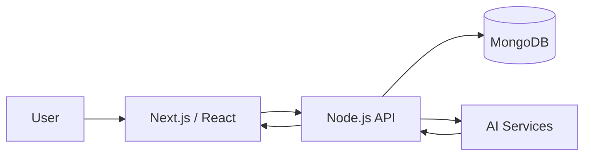

# AI Study Platform

> A full-stack AI-powered learning platform designed to help students organize study material, create notes, generate flashcards, and interact with AI for personalized learning assistance.

---

## Overview

The **AI Study Platform** combines modern web technologies and AI capabilities to create a centralized environment for smarter and more efficient learning.

The platform enables users to:

- Create and manage study notes
- Generate AI-powered flashcards from learning material
- Interact with AI for concept explanations and study assistance
- Organize learning resources in a structured workflow

The application follows a client-server architecture with a **Next.js/React frontend**, **Node.js backend**, and **MongoDB database**.

---

## Architecture



---

## Key Features

### Notes Management
- Create, edit, and manage study notes
- Organize learning content for revision

### AI-Powered Flashcards
- Convert study material into question-answer flashcards
- Automate repetitive flashcard creation

### AI Study Assistance
- Ask questions about learning topics
- Generate explanations and study-oriented responses

### Modular Full-Stack Architecture
- Separate frontend and backend applications
- REST-based communication between client and server
- MongoDB-based persistent storage

---

## Tech Stack

| Layer | Technologies |
|---|---|
| Frontend | Next.js, React, JavaScript, TypeScript |
| Backend | Node.js |
| Database | MongoDB |
| AI | AI-powered content generation |
| Development | Git, GitHub, npm |

---

## Project Structure

```text
ai-study-platform/
│
├── client/              # Next.js / React frontend
│
├── server/              # Node.js backend
│
├── LICENSE
└── README.md
```

---

## Getting Started

### Prerequisites

- Node.js 18+
- npm
- MongoDB
- Git

### Clone

```bash
git clone https://github.com/rakeshpedapudi07/ai-study-platform.git
cd ai-study-platform
```

### Frontend

```bash
cd client
npm install
npm run dev
```

### Backend

Open a separate terminal:

```bash
cd server
npm install
npm run dev
```

> Configure the required environment variables before starting the backend.

Example:

```env
PORT=5000
MONGODB_URI=your_mongodb_connection_string
AI_API_KEY=your_ai_api_key
```

**Do not commit credentials or API keys to the repository.**

---

## Project Goals

- Build a practical AI-assisted learning platform
- Apply full-stack development principles
- Integrate AI into real-world learning workflows
- Develop a scalable and maintainable application architecture
- Provide an extensible foundation for future learning features

---

## Future Enhancements

- [ ] Personalized study plans
- [ ] PDF/document-based learning
- [ ] RAG-based question answering
- [ ] Automated testing
- [ ] Cloud deployment

---

**Status:** 🚧 Under Development  
**Type:** Team Project  
**Deployment:** Not currently deployed
---
## Team

### Project Lead

**Rakesh Pedapudi**

Responsible for project architecture, development coordination, and overall implementation.

### Team Members

**Akash Gummela**  
Full-Stack Development & Feature Implementation

**Nagesh Bantu**  
Development & Feature Implementation

---
## License

This project is licensed under the **MIT License**.

See [LICENSE](LICENSE) for details.
