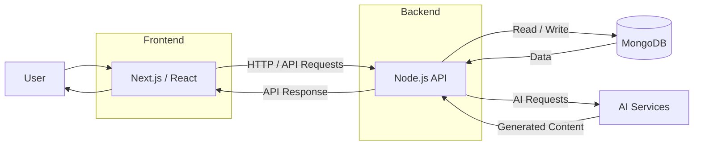

# AI Study Platform

> A full-stack AI-powered learning platform designed to help students organize study material, create notes, generate flashcards, and interact with AI for personalized learning assistance.

**Status:** 🚧 Under Development  
**Project Type:** Team Project  
**Deployment:** Not currently deployed

---

## Overview

**AI Study Platform** is a full-stack web application that integrates AI into everyday learning workflows.

The platform is designed to help students:

- Create and manage study notes
- Generate flashcards from learning material
- Interact with AI for learning assistance
- Organize study resources in a centralized platform

The application follows a **client-server architecture** with a Next.js/React frontend, Node.js backend, and MongoDB database.

---

## Architecture



### Request Flow

```text
User
  ↓
Next.js / React Frontend
  ↓
Node.js Backend API
  ├── MongoDB
  └── AI Services
  ↓
API Response
  ↓
Frontend
  ↓
User
```

---

## Key Features

### 📝 Notes Management

- Create and manage study notes
- Organize learning material
- Maintain reusable study content

### 🧠 AI-Powered Flashcards

- Generate flashcards from study material
- Convert learning content into question-answer pairs
- Support efficient revision

### 🤖 AI Study Assistance

- Interact with AI for learning support
- Ask questions about study topics
- Generate explanations and learning-oriented responses

### 🏗️ Full-Stack Architecture

- Separate frontend and backend applications
- REST-based client-server communication
- MongoDB-based persistent storage
- Modular application structure

---

## Technology Stack

| Layer | Technologies |
|---|---|
| Frontend | Next.js, React, JavaScript, TypeScript |
| Backend | Node.js |
| Database | MongoDB |
| AI | AI-powered content generation |
| Version Control | Git, GitHub |
| Package Management | npm |

---

## Project Structure

```text
ai-study-platform/
│
├── client/
│   ├── app/
│   ├── components/
│   ├── public/
│   └── ...
│
├── server/
│   ├── routes/
│   ├── controllers/
│   ├── models/
│   ├── services/
│   └── ...
│
├── LICENSE
└── README.md
```

### Directory Responsibilities

| Directory | Responsibility |
|---|---|
| `client/` | Next.js / React frontend and user interface |
| `server/` | Node.js backend, APIs, business logic and services |
| `LICENSE` | MIT License |
| `README.md` | Project documentation |

> The internal folders shown above represent the intended application structure. Refer to the repository for the current implementation.

---

## Getting Started

### Prerequisites

Make sure the following are installed:

- Node.js 18+
- npm
- MongoDB
- Git

### Clone the Repository

```bash
git clone https://github.com/rakeshpedapudi07/ai-study-platform.git
cd ai-study-platform
```

### Install Frontend Dependencies

```bash
cd client
npm install
```

### Install Backend Dependencies

Open a separate terminal:

```bash
cd server
npm install
```

---

## Environment Configuration

Create the required environment configuration for the backend.

Example:

```env
PORT=5000
MONGODB_URI=your_mongodb_connection_string
AI_API_KEY=your_ai_api_key
```

> Environment variables depend on the services configured in the project. Never commit API keys, database credentials, or other secrets to GitHub.

---

## Running the Application

### Start Backend

```bash
cd server
npm run dev
```

### Start Frontend

In a separate terminal:

```bash
cd client
npm run dev
```

The frontend and backend run independently during development.

---

## Development Workflow

```text
Feature / Study Requirement
          ↓
Frontend Implementation
          ↓
Backend API
          ↓
Database / AI Services
          ↓
Integration & Testing
          ↓
Feature Completion
```

---

## Project Goals

The project focuses on applying practical software engineering concepts to an AI-enabled learning application:

- Full-stack web development
- REST API development
- Database integration
- AI service integration
- Modular application architecture
- Team-based software development
- Maintainable and extensible code

---

## Future Enhancements

- [ ] User authentication and authorization
- [ ] AI-generated quizzes
- [ ] Spaced-repetition flashcards
- [ ] Learning progress dashboard
- [ ] Personalized study plans
- [ ] PDF/document-based learning
- [ ] RAG-based question answering
- [ ] Automated testing
- [ ] Cloud deployment
- [ ] CI/CD integration

---

## Team

### Project Lead

**Rakesh Pedapudi**

Responsible for overall project direction, architecture, development coordination, and implementation.

### Team Members

**Akash Gummela**  
Full-Stack Development & Feature Implementation

**Nagesh Bantu**  
Development & Feature Implementation

---

## Project Status

The project is currently **under development** and is **not publicly deployed**.

The repository contains the source code for local development and continued feature development.

---

## License

This project is licensed under the **MIT License**.

See the [LICENSE](LICENSE) file for details.
